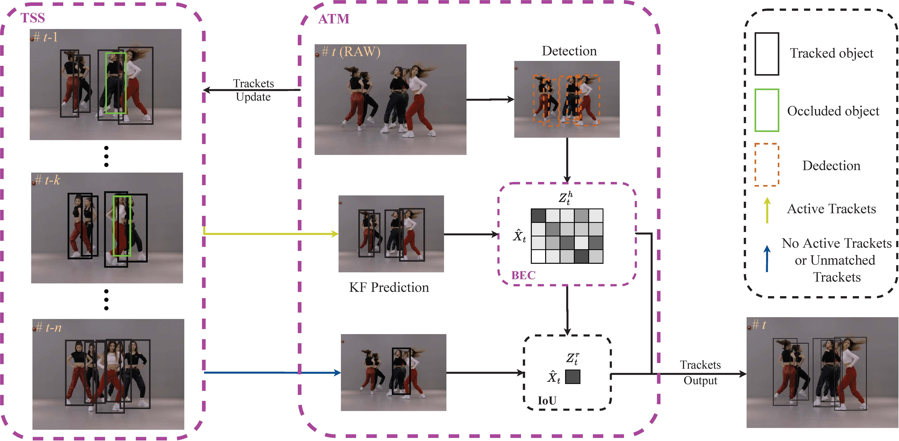

# BAM-SORT

 [](https://opensource.org/licenses/MIT) 


### Abstract
Multi-object tracking aims at estimating object bounding boxes and identity IDs in the video. Most tracking methods combine a detector and a Kalman filter using the IoU distance as a similarity metric for association matching for previous trajectories to match with the current detection box. These methods usually suffer from ID switches and fragmented trajectories in response to congested and frequently occluded scenarios. In order to solve this problem, this paper proposes a simple and effective association method. Firstly, a bottom edge cost matrix is introduced to use depth information to improve data association and increase robustness in the case of occlusion. Secondly, an activated trajectory matching strategy is introduced to reduce the interference of noise and transient objects on tracking. Finally, the trajectory deletion strategy is improved by introducing the number of trajectory state switches to delete trajectories caused by spurious high-scoring detection boxes in real time, which in turn reduces the number of fragmented trajectories. These innovations achieve excellent performance in various benchmarks, including MOT17, MOT20, and especially on DanceTrack where interactions and occlusions are frequent and severe.

### Highlights

- BAM-SORT is a **SOTA** heuristic trackers on DanceTrack and performs excellently on MOT17/MOT20 datasets.
- Maintains **Simple, Online and Real-Time (SORT)** characteristics.
- **Training-free** and **plug-and-play** manner.
- **Strong generalization** for diverse trackers and scenarios

### Pipeline
<center>

</center>


<!-- 
## News -->

## Tracking performance

### Results on DanceTrack test set

| Tracker          | HOTA | MOTA | IDF1 |
| :--------------- | :--: | :--: | :--: |
| OC-SORT          | 54.6 | 89.6 | 54.6 |
| BAM-SORT         | 64.3 | 91.3 | 68.7 | 

### Results on MOT17 challenge test set

| Tracker          | HOTA | MOTA | IDF1 |
| :--------------- | :--: | :--: | :--: |
| OC-SORT          | 63.2 | 78.0 | 77.5 |
| BAM-SORT         | 64.5 | 80.5 | 79.9 |

### Results on MOT20 challenge test set

| Tracker          | HOTA | MOTA | IDF1 |
| :--------------- | :--: | :--: | :--: |
| OC-SORT          | 62.1 | 75.5 | 75.9 |
| BAM-SORT         | 62.0 | 74.0 | 76.2 |


## Get Started
* See [INSTALL.md](./docs/INSTALL.md) for instructions of installing required components.

* See [GET_STARTED.md](./docs/GET_STARTED.md) for how to get started with BAM-SORT.

* See [MODEL_ZOO.md](./docs/MODEL_ZOO.md) for available YOLOX weights.

<!-- * See [DEPLOY.md](./docs/DEPLOY.md) for deployment support over ONNX, TensorRT and ncnn. -->


## Demo
```shell
python tools/bamsort_demo.py --path dancetrack0052 --det_type yolox_x --dataset dancetrack --dataset_type train
```

<center>

</center>


<!-- ## Citation

If you find this work useful, please consider to cite our paper:
```

```
Also see OC-SORT, which we base our work upon:
```
@article{cao2022observation,
  title={Observation-centric sort: Rethinking sort for robust multi-object tracking},
  author={Cao, Jinkun and Weng, Xinshuo and Khirodkar, Rawal and Pang, Jiangmiao and Kitani, Kris},
  journal={arXiv preprint arXiv:2203.14360},
  year={2022}
}
``` -->
## Acknowledgement
A large part of the code is borrowed from [YOLOX](https://github.com/Megvii-BaseDetection/YOLOX), [OC-SORT](https://github.com/noahcao/OC_SORT), [ByteTrack](https://github.com/ifzhang/ByteTrack), [HybridSORT](https://github.com/ymzis69/HybridSORT), [BoT-SORT](https://github.com/NirAharon/BOT-SORT), [Deep-OC-SORT](https://github.com/GerardMaggiolino/Deep-OC-SORT) and [FastReID](https://github.com/JDAI-CV/fast-reid). Many thanks for their wonderful works.

